# 归因分析项目 — 总体架构图

> Mermaid 源码 · 可点击放大：建议在 VSCode（装 Mermaid 插件）/ GitHub / Obsidian / Typora 打开；
> 或打开同目录下的 `architecture.html` / `sequence.html` 获得可缩放的浏览器视图。

## 1. 总体架构图

```mermaid
%%{init: {"flowchart": {"htmlLabels": true, "curve": "linear"}, "themeVariables": {"fontSize": "14px"}}}%%
flowchart LR
    %% ============ 颜色定义 ============
    classDef clientStyle   fill:#E3F2FD,stroke:#1565C0,stroke-width:2px,color:#0D47A1
    classDef agentStyle    fill:#FFF3E0,stroke:#E65100,stroke-width:2px,color:#BF360C
    classDef dataStyle     fill:#E8F5E9,stroke:#2E7D32,stroke-width:2px,color:#1B5E20
    classDef authStyle     fill:#F3E5F5,stroke:#6A1B9A,stroke-width:2px,color:#4A148C
    classDef infraStyle    fill:#ECEFF1,stroke:#455A64,stroke-width:1.5px,color:#263238
    classDef mockStyle     fill:#FFFDE7,stroke:#F9A825,stroke-width:1.5px,color:#F57F17
    classDef proxyStyle    fill:#FFFFFF,stroke:#6A1B9A,stroke-width:1.5px,stroke-dasharray:5 3,color:#4A148C

    %% ============ 客户端 ============
    subgraph CLIENT["🖥️ 浏览器 / 前端 (auth/web)"]
        direction TB
        UI["React 19 + Vite + Bun<br/>shadcn/ui · Tailwind · RR7<br/>TanStack Query · Zustand"]
    end
    class UI clientStyle

    %% ============ insight-agent ============
    subgraph INSIGHT["🧠 insight-agent · FastAPI (核心智能体)"]
        direction TB
        FR["前端托管 + SPA 回退<br/>routers/frontend.py"]
        CR["业务路由<br/>/api/chat/* · /api/chat/attachment/*"]
        AR["管理路由<br/>/api/reload"]
        MW["中间件链<br/>trace → auth → CORS"]
        SVC["业务服务<br/>services/chat_service.py"]
        REPO["Repository 层<br/>conversation · message<br/>context_compaction · ws_token"]
        MAP["消息 Mapper<br/>Schema ↔ Entity ↔ LangChain"]
        AC["Agent 运行时<br/>agent/agent.py · deepagents"]
        MODEL["LLM 模型<br/>init_chat_model"]
        TOOLS["本地工具<br/>db_query · return_file<br/>+ read/write/execute/task/todos"]
        SKL["Skill 目录<br/>insight · docx · pdf · pptx · xlsx"]
        MCP["MCP 客户端<br/>sse/stdio/ws/http"]
        WS["对话工作区<br/>LocalShellBackend + CompositeBackend"]
    end
    class FR,CR,AR,MW,SVC,REPO,MAP,AC,MODEL,TOOLS,SKL,MCP,WS agentStyle

    %% ============ data-agent ============
    subgraph DATA["📊 data-agent · Text-to-SQL 服务"]
        direction TB
        DA1["入口 main.py (SSE)"]
        DA2["元数据索引<br/>Elasticsearch"]
        DA3["Text-to-SQL 模板<br/>+ Schema 检索"]
        DA4["数据侧 LLM"]
    end
    class DA1,DA2,DA3,DA4 dataStyle

    %% ============ auth ============
    subgraph AUTH["🔐 auth · 统一认证中心"]
        direction TB
        AA["FastAPI 认证后端<br/>OAuth2.0 + PKCE (S256)"]
        AD["MySQL: user · role · permission<br/>session · code · token"]
    end
    class AA,AD authStyle

    %% ============ 基础设施 ============
    subgraph INFRA["🏗️ 基础设施"]
        direction TB
        I1["MySQL (insight-agent)<br/>conversation · message · context_compaction"]
        I2["Redis<br/>WebSocket 一次性令牌"]
        I3["Elasticsearch<br/>数仓元数据索引"]
        I4["LLM 推理服务"]
    end
    class I1,I2,I3,I4 infraStyle

    %% ============ dbmock ============
    subgraph MOCK["🗃️ dbmock · 业务数据生成 (离线)"]
        direction TB
        M1["数仓 SQL<br/>sql/warehouse.sql"]
        M2["5 批次生成器<br/>①静态维度 ②商品维度<br/>③营销 ④交易核心 ⑤行为事件"]
        M3["种子 JSON<br/>brand · category · geo · payment · shops · logistics"]
    end
    class M1,M2,M3 mockStyle

    %% ============ 调用关系 ============
    UI -- "HTTP / WebSocket" --> FR
    FR -. "反向代理 /auth-api/*" .-> AA

    FR --> CR --> MW --> SVC
    SVC --> REPO
    SVC --> MAP
    SVC --> AC
    AC --> MODEL
    AC --> TOOLS
    AC --> SKL
    AC --> MCP
    AC --> WS

    TOOLS -- "SSE 流式" --> DA1
    DA1 --> DA2
    DA1 --> DA3
    DA1 --> DA4
    DA2 --> I3
    DA3 -- "SQL 查询" --> M2
    DA4 --> I4

    REPO --> I1
    REPO --> I2
    MW --> AA
    AA --> AD
    MODEL --> I4
    MCP --> I4

    M2 --> M1
    M1 -- "数仓表" --> I1
    M2 -- "种子数据" --> M3

    class FR proxyStyle
```

### 🎨 颜色图例

| 颜色 | 模块 | 关键职责 |
| --- | --- | --- |
| 🟦 蓝色 | 浏览器 / 前端 | UI、用户交互、PKCE 流程 |
| 🟧 橙色 | insight-agent | Agent 组装、对话编排、流式聊天、Skill 调用 |
| 🟩 绿色 | data-agent | Text-to-SQL、元数据检索、SSE 输出 |
| 🟪 紫色 | auth | OAuth2 + PKCE、introspection、用户/角色/权限管理 |
| ⬜ 灰色 | 基础设施 | MySQL · Redis · Elasticsearch · LLM |
| 🟨 黄色 | dbmock | 数仓生成、状态机驱动、SCD 拉链 |
| ⬜ 虚线 | 反向代理 | insight-agent 代理 `/auth-api/*` 解决跨域 |

### 🔗 跳转

- [← 返回 insight.md 主文档](../insight.md)
- [→ 查看端到端执行时序图](sequence.md)
- [→ 浏览器可缩放视图](architecture.html)
